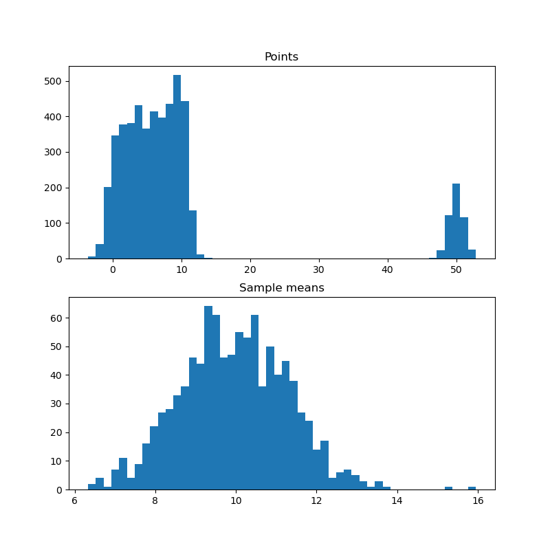

# stats_learning
Repo with some Statistics examples

## Installation

Python version: `3.10.0`

Packages: `python -m pip install -r requirements.txt`

## CLT

Script: [clt_multimodal.py](clt_multimodal.py)

Test whether CLT works on multimodal distributions. Example:

```bash
python clt_multimodal.py \
    --n_modes 10 \
    --mode_positions skewed \
    --n_samplings 1000 
```


